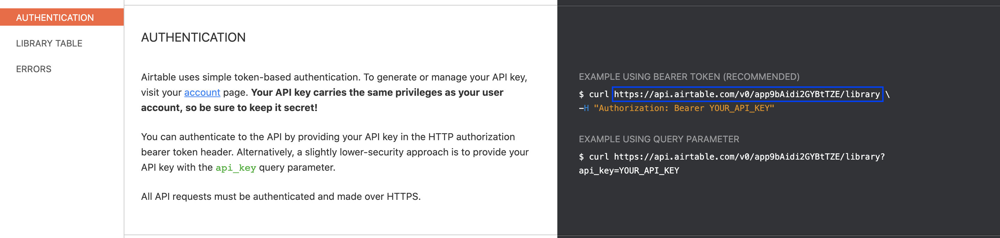
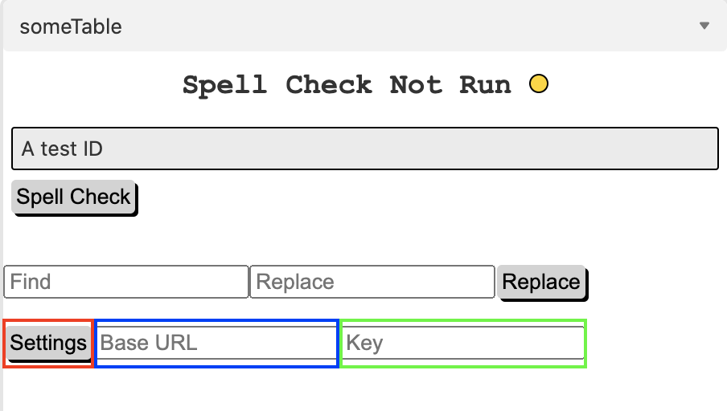
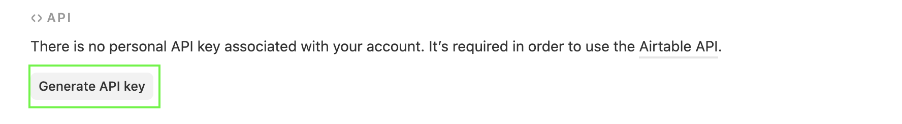

# Overview

Airtable currently has no spellcheck fuction, this custom app adds a spellcheck function to an Airtable Base as well as a Find and Replace function. It utilizes a separate Airtable Base to store the dictionary allowing each user to customize the dictionary.


## Setup


1) Download the app from the Airtable App Store.
2) Copy the dictionary base from [here](https://airtable.com/shrQLb2AcTeNDzjs3)
3) Go to [Airtable API](https://airtable.com/api). Open the Dictionary page and scroll down to Authetication. 
4) Copy the Base URL (outlined in blue in the figure below).


5) Return to the app and click the settings button (outlined in red in the figure below), then paste that URL into the Base URL field (outlined in blue in the figure below). 


6) Return to [Airtable API](https://airtable.com/api) and click the account link (outlined in red in the figure below).


7) If you have not created an API key in the past, press the Generate API Key button to generate one (outlined in green in the figure below). Do not share this key with anyone, it has the same power as your username and password. 


8) Paste the key into the Key field (outlined in green in the figure below). It will be stored in your app and will allow you to access the Dictionary. Nobody else will have access to your key.


9) Reload the app and you will ready to start. 

## Technology
- React
- Airtable Blocks SDK
- Airtable REST API
- AXIOS

## Cursor

### Spell Check
For the spell check function, the Cursor hook from Airtable Blocks SDK is used extract the selected Record ID and the slected Field ID, if no field is selected the first field and record are selected by default.

``` javascript
    useLoadable(cursor);
    useWatchable(cursor, ['selectedRecordIds', 'selectedFieldIds']);
    const fieldId = cursor.selectedFieldIds[0] || defaultFieldId
    const recordId = cursor.selectedRecordIds[0] || defaultRecordId
    const record = recordId ? useRecordById(table, recordId) : useRecords(table)[0]
    const currentCell = fieldId ? record.getCellValue(fieldId) : record.getCellValue(defaultFieldId)
```

### Find and Replace

For the find and replace function, replacements are only made in the area selected by the cursor, this is also accomplished using the Cursor. On initialization all fields and records are stored as constants. When a find and replace is exicuted, these records and fields are filtered by the currently selected field IDs and recordIDs  

``` javascript
    const allRecords = useRecords(table)
    const allFields = table.fields
```
...
``` javascript
    const fieldIds = cursor.selectedFieldIds
    const recordIds = cursor.selectedRecordIds
    let selectedRecords = allRecords
    let selectedFields = allFields


    if (type === "selected"){
        selectedRecords = allRecords.filter((record) => recordIds.includes(record.id))
        selectedFields = allFields.filter((field) => { return fieldIds.includes(field.id)})
    }
```

## Dictionary Comparison

To compare the text in a cell to the dictionary, the cell string is split into a words array and passed as an argument to checkSpelling. Each word is added to a filterByFormula param which is is used in an AXIOS GET request to the Dictionary Base. The results are compared to the words. Any word not included in the results is not included in the dictionary and therefore is a spelling error. 

```javascript
    export const checkSpelling = async(words) => {
        let filterByFormula = '?filterByFormula=OR('
        words.forEach(word => {
            const filterSection = `{word}='${word.toLowerCase()}', `
            filterByFormula += filterSection
        });
        filterByFormula = filterByFormula.slice(0, -2)
        filterByFormula+= ")"
        const res = await axiosInstance.get(filterByFormula)
        try {   
            let results = res.data.records.map((record) => { return (record.fields.word)})
            const errors = {}

            words.forEach((word, idx) => {
                if (!results.includes(word.toLowerCase())) {
                    errors[word] = idx
                }
            })

            return errors
        } catch {
            return null
        }
    }
```

## Correcting the Cell

Once the cell is 